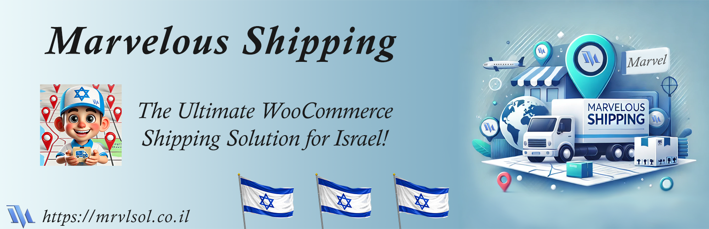

# 🌍 Marvelous Shipping Free Version for WooCommerce (Israel)

<p align="start">
    
</p>

## **The most advanced WooCommerce shipping & postcodes plugin in Israel!** 🚀

**Marvelous Shipping** is a powerful **WooCommerce shipping pluginfor Israel**, that enhances your store's shipping capabilities. From **simple global rates** to **advanced automated calculations**, this plugin ensures that your **shipping process is smooth, flexible, and optimized for your business needs.**

🔹 **This is the FREE version of the plugin** – A **lightweight** version of our **Pro** and **Ultimate** editions.  
🔹 Upgrade to **Pro** or **Ultimate** for **cutting-edge automation, and powerful control over shipping calculations in Israel!**

📢 **Quick Checkout for Premium Versions:**  
💳 **[Upgrade in less than 2 minutes!](https://mrvlsol.co.il/?marvelous_shipping&utm_source=github_free_repo)**

---

## 🛠️ Features Comparison

| Feature                                                                    | Free 🎉 | Pro ⚡ | Ultimate 🚀 |
| -------------------------------------------------------------------------- | ------- | ------ | ----------- |
| **WooCommerce integration**                                                | ✅      | ✅     | ✅          |
| **Global flat-rate pricing**                                               | ✅      | ✅     | ✅          |
| **Enable/disable shipping to specific cities**                             | ✅      | ✅     | ✅          |
| **Custom price per city**                                                  | ✅      | ✅     | ✅          |
| **Dropdowns for city & street selection (Select2)**                        | ✅      | ✅     | ✅          |
| **Instant data loading (zero delays)**                                     | ✅      | ✅     | ✅          |
| **Customizable checkout fields (building, entrance, floor, etc.)**         | ✅      | ✅     | ✅          |
| **Basic analytics (shipping distribution by region)**                      | ✅      | ✅     | ✅          |
| **Built-in documentation for all available features**                      | ✅      | ✅     | ✅          |
| **Premium support forum access**                                           | ❌      | ✅     | ✅          |
| **Advanced shipping price mapping (interactive map)**                      | ❌      | ✅     | ✅          |
| **Disable shipping in specific areas (e.g., beyond the Green Line)**       | ❌      | ✅     | ✅          |
| **Import/export settings via file**                                        | ❌      | ✅     | ✅          |
| **Automatic backup of settings**                                           | ❌      | ✅     | ✅          |
| **Auto-update city & street database (government data)**                   | ❌      | ✅     | ✅          |
| **Extra fee for floors above X**                                           | ❌      | ✅     | ✅          |
| **Additional per-floor fee (above X floor)**                               | ❌      | ✅     | ✅          |
| **Free shipping for orders above X amount**                                | ❌      | ✅     | ✅          |
| **Extra charge per KG above X KG**                                         | ❌      | ✅     | ✅          |
| **Customizable quick messages at checkout**                                | ❌      | ✅     | ✅          |
| **One-click plugin update**                                                | ❌      | ✅     | ✅          |
| **Priority support**                                                       | ❌      | ✅     | ✅          |
| **Import order history into shipping distribution graph**                  | ❌      | ✅     | ✅          |
| **Checkout message for additional shipping fees (per KG, floor, etc.)**    | ❌      | ✅     | ✅          |
| **Auto-detect postal code in checkout**                                    | ❌      | ❌     | ✅          |
| **Dynamic shipping rates based on distance (airline distance estimation)** | ❌      | ❌     | ✅          |
| **Custom zone-based pricing (e.g. 0-5km, 5-8km, etc.)**                    | ❌      | ❌     | ✅          |
| **Automatic cloud backup & restore**                                       | ❌      | ❌     | ✅          |

🎯 **Get started today and take control of your WooCommerce shipping process!**

---

## 📸 Free Screenshots 🚀🚀

<p align="center" style="display: flex; justify-content: space-evenly; flex-wrap: wrap;">
    <a href="https://mrvlsol.co.il/img/marvelous_shipping/free/full_shot.png" target="_blank">
        
    </a>
</p>

---

## 📸 Premium Screenshots 🚀🚀

<p align="center" style="display: flex; justify-content: space-evenly; flex-wrap: wrap;">
    <a href="https://mrvlsol.co.il/img/marvelous_shipping/premium/distance.png" target="_blank">
        
    </a>
    <a href="https://mrvlsol.co.il/img/marvelous_shipping/premium/shipping-options.png" target="_blank">
        
    </a>
    <a href="https://mrvlsol.co.il/img/marvelous_shipping/premium/built-in-docs.png" target="_blank">
        
    </a>
    <a href="https://mrvlsol.co.il/img/marvelous_shipping/premium/interactive-map.png" target="_blank">
        
    </a>
    <a href="https://mrvlsol.co.il/img/marvelous_shipping/premium/manual-settings.png" target="_blank">
        
    </a>
    <a href="https://mrvlsol.co.il/img/marvelous_shipping/premium/updater.png" target="_blank">
        
    </a>
</p>

---

## 🚀 Installation Guide

### **1️⃣ Download & Install:**

#### **📌 Method 1️⃣: Install from WordPress Plugin Directory**

1. Go to **WordPress Admin → Plugins → Add New**
2. Search for **Marvelous Shipping**
3. Click **Install Now**, then **Activate**

#### **📌 Method 2️⃣: Manual Installation (via GitHub)**

1. **Download the latest version** from this repository:
    - Click **Code** → 📦 **Download ZIP**
    - 🗂 **Extract** the contents to your local machine
2. **Create the plugin folder if it does not exist:**
    - Navigate to your WordPress installation and create:
        ```
        wp-content/plugins/marvelous-shipping/
        ```
3. 🚀 **Upload the extracted files to your server:**
    - Use **FTP** or **File Manager** to navigate to:
        ```
        wp-content/plugins/marvelous-shipping/
        ```
    - 📌 **Place** the extracted files inside this folder
4. ⚙️ Go to **WordPress Admin → Plugins**
5. ✅ **Find Marvelous Shipping and click Activate**

⚠️ **NOTE:** First activation takes around **30-60 seconds** due to database configuration.

---

### **2️⃣ Configure the Plugin:**

🛠 **Setup your shipping rules & restrictions:**

-   Go to **WooCommerce → Settings → Marvelous Shipping** 🏪
-   Set up **shipping rules, pricing, and restrictions** 🚚
-   Adjust settings for **cities, streets, and checkout fields** 📍

---

### **3️⃣ You're All Set! 🎉**

Your store is now ready with **advanced shipping controls** 🏆🚀

---

## 🚀 Upgrading to Pro or Ultimate

### **Why Upgrade?**

-   **Pro** adds **advanced pricing, automation, and analytics** 🚀
-   **Ultimate** unlocks **Advance shipping calculations, dynamic pricing, and cloud backups** 🌍

💳 **[Upgrade now (Less than 2 min checkout!)](https://mrvlsol.co.il/?marvelous_shipping&utm_source=github_free_repo)**

---

## 📖 License

Marvelous Shipping Free edition is released under the **GNU General Public License v2.0** or later.

---

## 👨‍💻 Support & Contact

Need help? **We’ve got you covered!** 💡

📌 **Support Forum (Pro & Ultimate users only)**: [Visit Support](https://mrvlsol.co.il/?marvelous_shipping_support&utm_source=github_free_repo)  
📌 **Company Website**: [Marvel Software Solutions](https://mrvlsol.co.il/?utm_source=github_free_repo)  
📌 **Email Support**: office@mrvlsol.com

📢 **Don't forget to ⭐ Star this repository if you find Marvelous Shipping useful!** 🚀
<br><br><br><br>

<p align="start">
    <a href="https://mrvlsol.co.il/?utm_source=github_free_repo" target="_blank">
        
    </a>
</p>
